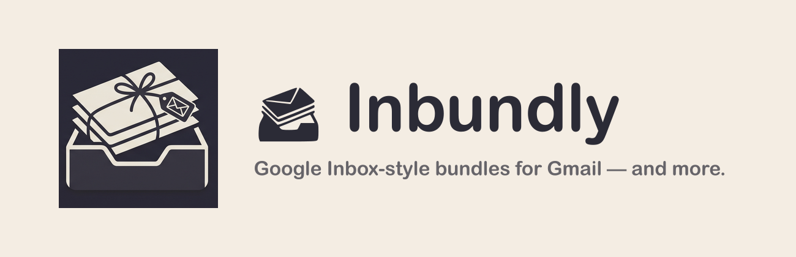

<p align="center">
  
</p>

# Inbundly: Google Inbox-style bundles for Gmail

**Inbundly** brings back the best part of Google Inbox — **bundles** — to Gmail, and keeps
going: it groups your email into tidy, collapsible bundles and adds more ways to organize
your inbox.

> **Fork notice:** Inbundly is [benoror/inboxy](https://github.com/benoror/inboxy), a
> maintained, rebranded fork of [teresa-ou/inboxy](https://github.com/teresa-ou/inboxy)
> (originally by Teresa Ou), with additional options for combined-label bundles, bundle
> coloring, custom bundles, and Stylus theme-matching. Licensed GPL-3.0 (see
> [`NOTICE.md`](NOTICE.md) for the statement of changes).

## Features

* Messages with the same label are bundled together in your inbox
* Optionally bundle by the whole *set* of labels, so threads sharing labels
  A + B form their own bundle, colored by the first label (enable in Options)
* Priority bundles: force chosen labels (or label sets) to always group
  together regardless of a thread's other labels — e.g. `Bank`, `School/*`
  (subtree), or `Work + Urgent`; first matching rule wins (configure in Options)
* Custom bundles: select any messages in Gmail and click the floating
  "Bundle selected" button to group them on the fly — no Gmail label needed.
  Custom bundles override label-based grouping, stick across reloads, and sync
  to your other signed-in Chrome browsers. Manage or delete them under
  Options → Custom bundles
* Single-item bundles are skipped by default, shown as regular messages
* Archive all bundled messages on the current page quickly
* Star a message to pin it outside of its bundle
* Intuitive date headings
* Supports light and dark themes
* Optionally color bundles to match their Gmail label color — either a subtle
  background tint or just the left accent bar and text, both theme-aware
  (enable in Options)
* The pinned-messages toggle and per-bundle archive-all button are optional
  (hidden by default; enable them under Options → Features)
* Optional Stylus userstyle color-matching: when enabled, bundle colors are
  snapped to a detected Catppuccin theme's palette (Options → Bundle colors →
  Stylus; off by default)

Learn more at [inbundly.com](https://inbundly.com).

## Setup

Inbundly uses webpack to bundle js files:

```bash
# Install dependencies
npm install

# Build with webpack to create dist/content.js
npm run build

# Rebuild automatically on every save (development)
npm run watch
```

The `dist` directory can then be loaded as an [unpacked extension](https://developer.chrome.com/extensions/getstarted).

## Feedback

Feel free to [send feedback](https://github.com/benoror/inboxy/issues) by filing an issue.

## Acknowledgements

* [material.io](https://material.io/resources/icons/): Icons in [dist/assets/](https://github.com/benoror/inboxy/tree/master/dist/assets/), [dist/options/assets/](https://github.com/benoror/inboxy/tree/master/dist/options/assets/), and [dist/popup/assets/](https://github.com/benoror/inboxy/tree/master/dist/popup/assets/) are modified versions of icons from material.io. The original material.io icons are licensed under [Apache License 2.0](https://www.apache.org/licenses/LICENSE-2.0.html).

## License

[GPL-3.0](https://github.com/benoror/inboxy/blob/master/COPYING). Copyright (C) 2020 [Teresa Ou](https://github.com/teresa-ou); modifications Copyright (C) 2026 [Ben Orozco](https://github.com/benoror). See [`NOTICE.md`](NOTICE.md).
